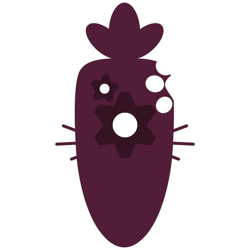

```plaintext
Hello, there is something I want to announce.
This repository will be archived.
Now why? It is because Carrot/Ninjin (the engine of this Nin modules repo) already have the built-in libraries, making this repository redundant to be there.
From now on, I'll do PRs to the main Carrot repository.
Thanks.
```

# <p align="center">Ninjin Language Modules<br></p>
The Ninjin Language Modules (NLM) is a set of custom FFI modules and binds for the [Carrot/Ninjin Language](https://github.com/NekoMimiOfficial/Carrot) project by [NekoMimi](https://github.com/NekoMimiOfficial), making the language more functional while making it lean by using C/C++ backends for it.
